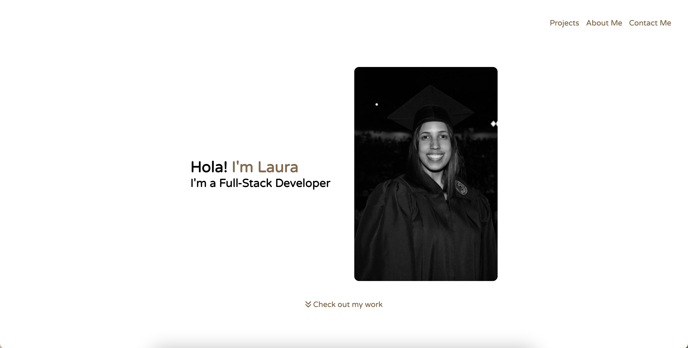
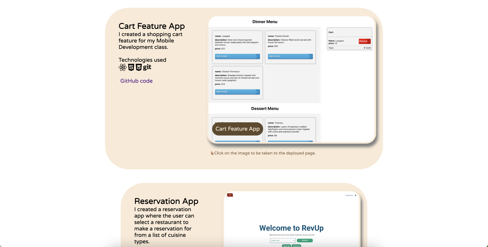
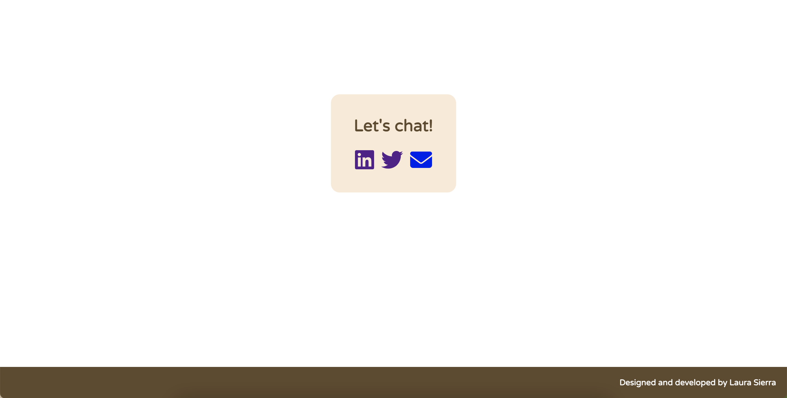

# Laura Sierra's Portfolio


## Screenshots
Landing page:


Part of my projects section:


About me section:


Section for my socials:


## Description

To showcase my growth as a web developer for myself and employers, I have created this portoflio of the work I have done and will be doing. This portfolio, in itself, will improve and see changes in its technologies used and designs as I learn new skills in my current coding bootcamp at UC Berkeley.

## Technologies

HTML, CSS, and Git

## Future implementations

For a better user experience, I will improve the semantics and viewport responsiveness. As I strengthen my React skills, I'm planning on using this framework for the development instead. Additionally, I'll invest more time in the design prior to the re-development

## Code snippets
```
<!-- Third project: CSS Snippet app -->
        <div class="project-card">
            <div class="card-info">
                <h2>CSS Cheatsheet App</h2>
                <p>Created a CSS Snippet Cheatsheet alongside a class partner.</p>
                <br>
                <div class="tech-info">
                    <p>Technologies used</p>
                    <i class="fa-brands fa-html5 fa-xl"></i>
                    <i class="fa-brands fa-css3-alt fa-xl"></i>
                    <i class="fa-brands fa-git fa-xl"></i>
                </div>
                <br>
                <a href="https://github.com/jeffz98/my-special-mini-project">GitHub code</a>
            </div>
            <!-- Screenshot of project -->
            <figure>
                <a href="https://jeffz98.github.io/my-special-mini-project/" target="_blank"></a>
                <p class="image-title">CSS Cheatsheet App</p>
                <figcaption>👆🏽Click on the image to be taken to the deployed page.</figcaption>
            </figure>
        </div>
    </section>
```
I divided every section of my portfolio using the `section` tag for semantics-- I find it very important for the organization to make sense to me, a collaborator, any other person, and screen readers. Within it, `div`s were used for further division, where its classes would determine their purpose and give styling. Worth pointing out are the `i` tags which I gathered from [Font Awesome](https://fontawesome.com/). These are icons I used to denote the technologies I used for each project.

## Deployed website link

https://laurasierra17.github.io/my-portfolio/

### User Information
- [LinkedIn](https://www.linkedin.com/in/laurasierra2022)
- [Portfolio](http://www.laura-sierra.com)